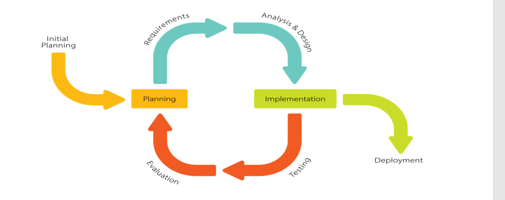

# CHAPTER III
# METHODOLOGY

This section describes the study's methodology, which includes the research design, study population, instrument development, validity and reliability testing, data collection procedures, and statistical analysis that will be used in this research study.

## Software Development Methodology

![Figure 3.1. Iterative Development Model for GeoFarm-IS]

**Figure 3.1. Iterative Development Model for the GeoFarm-IS: Geographic Farm Information System**

The researchers used the iterative development model as the software development methodology in developing the web-based Geographic Farm Information System (GeoFarm-IS) for the Municipal Agriculture Office. This approach followed a step-by-step and organized process. The process consisted of six main stages: initial planning, requirements gathering, analysis and design, testing, evaluation, and deployment. It allowed the researchers to review and improve previous stages in response to feedback received at each iteration. This approach enabled a flexible development process that successfully adapted to changing requirements.

## Initial Planning

During the initial planning phase, agricultural officers, data encoders, and farmers were involved in a thorough assessment to determine specific needs and gain an understanding of the existing agricultural information management procedures. It was essential to understand the processes in the Municipal Agriculture Office, including farmer registration, farm parcel mapping, crop production tracking, livestock inventory management, assistance program distribution, and report generation. By examining the existing administrative procedures, the researchers identified inefficiencies that the manual system failed to address, such as data management issues, time-consuming processes, poor accessibility and retrieval, security and confidentiality risks, limited GIS mapping capabilities, and inadequate reporting features. Resolving these issues ensured that the proposed system was designed to increase user satisfaction and overall operational effectiveness.

## Planning

The developed system underwent a thorough process that includes requirement analysis, design and planning. This procedure creates the system requirements into a working software application. Several data gathering methods were employed by the researchers in order to determine reference points for the web-based Geographic Farm Information System.

### Internet Research

To collect data for the study, the researchers used a variety of Internet sources. The internet provided access to numerous resources, including research papers, articles, and applications relevant to agricultural information systems, GIS mapping technologies, and crop yield prediction models.

### Questionnaires

The researchers provided a set of questions given to agricultural officers, IT experts, farmers, and data encoders to evaluate the web application and for system testing.

### Interview

To obtain important details regarding the Geographic Farm Information System and identify potential issues, the researchers conducted interviews with participants from the Municipal Agriculture Office, including the Municipal Agriculturist, agricultural technicians, and selected farmers.

## Requirements

This section outlines the software and hardware requirements needed for the development of the Geographic Farm Information System to ensure smooth operation and compatibility during the development process.

**Table 3-1. Software Requirements for Development**

| Description | Used |
|-------------|------|
| Browser | Google Chrome, Microsoft Edge, Opera and others |
| Text Editor | Visual Studio Code |
| Version Control | GitHub |
| Local server | XAMPP |
| Programming Language | PHP (Laravel 11), React JS, Tailwind CSS |
| Database | MySQL 8.0 |
| GIS Library | Leaflet.js, React-Leaflet |
| Operating System | Windows 11 (or newer) |
| MS Office | Word and Excel |

The researchers used the selected software tools shown in Table 3-1 during the development of GeoFarm-IS. Google Chrome, Microsoft Edge, Opera, and other browsers were used to test and run the web application across multiple platforms for compatibility. Visual Studio Code served as a powerful and lightweight text editor for writing and debugging code, while XAMPP functioned as the local server, allowing the researchers to run and test the system. GitHub was used for version control, enabling collaboration and tracking of code changes throughout development. The programming languages PHP (Laravel 11) for backend logic, React JS for dynamic user interfaces, and Tailwind CSS for rapid front-end styling supported the creation of a responsive and functional web application. MySQL 8.0 served as the database management system for storing agricultural data. Leaflet.js and React-Leaflet were integrated for GIS mapping functionality, enabling interactive farm parcel visualization. Windows 11 ensured compatibility and stability with the latest software, while MS Office (Word and Excel) was used for documentation and report generation.

**Table 3-2. Hardware Requirements for Development**

| Description | Used |
|-------------|------|
| CPU | 11th Gen Intel® Core™ i5-1135G7 @ 2.40GHz 2.419Mhz |
| RAM | 8GB (or higher) |
| Hard Disk | 256GB SSD (or higher) |
| Monitor | 15.6" FHD (or external monitor with at least 1080p resolution) |
| Mouse and Keyboard | Standard USB/Wireless |
| Printer | Laser or Inkjet Printer (for document printing) |
| System Type | 64-bit Operating System, x64-based processor |

Table 3.2 shows the hardware requirements that the researchers used for the development of the system. An 11th Gen Intel® Core™ i5 processor provided sufficient computing power to handle development tools and multitasking. 8GB RAM or higher ensured smooth performance during programming and system simulation. A 256GB SSD offered faster data access and system responsiveness. A 15.6" FHD monitor or external display with at least 1080p resolution provided clear visibility for interface testing and design. Standard USB or wireless mouse and keyboard supported ease of navigation and control, while a laser or inkjet printer was used for printing reports and certificates. A 64-bit operating system ensured compatibility with modern development tools and efficient performance.

## Analysis

### Security Measures for Implementation

The computerization of works makes it extremely vulnerable to both record theft and transparency issues. To prevent data from being hacked or used by unauthorized system users, high barriers and walls can be ensured by implementing security measures during system implementation.

**1. Password Security.** Every account and resources need to be secured using a password that satisfies the following specifications, which the system must enforce automatically.

a. Must be at least 8 characters long.
b. User passwords are hashed in the database using PHP's bcrypt hashing algorithm.
c. Passwords must be masked during input, allowing only the last character to be briefly visible.

**2. Authentication and Authorization**

a. **Role Based Account Separation.** The system assigns users to different roles: Super Admin, Admin, Data Encoder, and Viewer. Super Admins have full access to manage system settings, users, and all modules. Admins handle administrative tasks related to farmers, parcels, assistance programs, and data management. Data Encoders have restricted access focused on data entry and updates, while Viewers have read-only access to reports and information. Admin accounts are separate from user accounts to ensure proper segregation of duties.

b. **Enforced Least Privilege Principles.** Each user is granted only the minimum access necessary for their tasks. Non-administrative accounts, like those for Data Encoders and Viewers, have restricted permissions to ensure security. The system follows the principle of least privilege, meaning users are given only the necessary rights to perform their functions, reducing the risk of unauthorized access or actions.

**3. CSRF Protection.** The system implements Cross-Site Request Forgery (CSRF) protection to prevent unauthorized commands from being transmitted from a user that the web application trusts.

**4. Data Validation.** All user inputs are validated both on the client-side and server-side to prevent SQL injection, XSS attacks, and other security vulnerabilities.

**5. Audit Trail.** The system maintains comprehensive audit logs that track all user actions, including create, read, update, and delete operations, ensuring accountability and traceability.

## Testing

The system was put into action, and users were given the chance to provide feedback. The researchers used this feedback to make necessary improvements to the established system.

### Functionality Test

Functionality testing was conducted using Unit Testing to ensure that all features of the web-based Geographic Farm Information System operated correctly according to the specified requirements. This included verifying that each function produced the expected output and behaved appropriately under normal and exceptional conditions. This stage ensured that all system features—including farmer management, farm parcel mapping, GIS visualization, crop production tracking, livestock inventory, assistance program management, crop yield estimation, and report generation—operated reliably and as intended. Unit Testing was applied throughout this process.

**Criteria For Unit Testing:**

- User Login and Authentication
- User and Access Management
- Data Accuracy
- Dashboard Functionality
- Farmer Registration and Profiling
- Farm Parcel Management
- GIS Mapping and Spatial Data
- Crop Production Tracking (Seasonal)
- Livestock Inventory Management
- Agricultural Assets Tracking (Tree Crops, Fishponds)
- Assistance Program Management
- Distribution Tracking
- Crop Yield Estimator (Predictive Analytics)
- Security Features
- Result Generation and Reports
- Performance Under Load
- Accessibility and Compatibility
- Error Handling and System Feedback

## Evaluation

The developed system complied with the ISO 25010 Software Quality Standard as part of the testing process, which consisted of the following characteristics:

**a. Functional Suitability** - The system's capacity to fulfill functional requirements was assessed, including determining whether the features and modules of the web-based Geographic Farm Information System (GeoFarm-IS) met user needs and the system's intended objectives.

**b. Performance Efficiency** - The system's performance was evaluated to ensure that GeoFarm-IS features and modules operated efficiently and met user requirements under normal and peak conditions, particularly during data-intensive operations like GIS rendering and report generation.

**c. Compatibility** - Compatibility testing was carried out to ensure that the system worked correctly across various devices, operating systems, browsers, and network configurations.

**d. Usability** - The accessibility and usability of the system's user interface were evaluated. To improve the user experience, elements including user satisfaction, navigation, and instruction clarity were taken into account.

**e. Reliability** - Reliability testing was conducted to ensure that the system could consistently and dependably perform its intended tasks. This included testing for stability, error-handling, and recovery from interruptions.

**f. Security** - The system's security features were examined to confirm that data was protected from unauthorized access. This included assessing data encryption protocols, user access levels, role-based permissions, and login procedures.

**g. Maintainability** - The maintainability of the system was evaluated by examining how easily it could be updated, modified, or debugged. This involved reviewing the modular design, documentation, and code structure.

**h. Portability** - The system's suitability for installation and operation in various environments was assessed, ensuring minimal changes were required for deployment across different hardware and software platforms.

## Respondents of the Study

To gather data for the study, the researchers selected agricultural officers, IT experts, and farmers as the target populations.

**Table 3-3. Frequency Distribution of Respondents**

| Respondents | Frequency | Percentage |
|-------------|-----------|------------|
| IT Experts | 5 | 16.67% |
| Agricultural Officers | 15 | 50% |
| Farmers | 10 | 33.33% |
| **Total** | **30** | **100%** |

This table presents the 30 respondents selected for the study, consisting of 5 (16.67%) IT experts, 15 (50%) agricultural officers, and 10 (33.33%) farmers. These participants were carefully chosen to provide a comprehensive evaluation of the system's core features, ensuring that it functions effectively and meets the needs of all user groups. Their feedback helps assess usability, reliability, and overall performance across different perspectives, from technical expertise to everyday operational use within the Municipal Agriculture Office.

## Sampling Technique

The respondents were selected for the study using a non-probability purposive sampling technique, which allowed the researchers to choose individuals based on their expertise, experience, and relevance to the system being evaluated. The participants were divided into three groups: IT experts, agricultural officers, and farmers. Each group actively participated in both unit testing and the ISO 25010 evaluation to assess the system's functionality, reliability, usability, and overall performance. This sampling approach ensured that respondents possessed the appropriate knowledge and practical experience to provide meaningful and informed feedback based on their specific role and interaction with the system. Additionally, the differing number of participants in each group was deliberate, reflecting the varying levels of involvement and significance of their contributions to particular testing activities, thereby ensuring a comprehensive evaluation of the system from multiple perspectives.

## Frequency Count and Percentage

To calculate the percentage, the researchers used the following formula:

```
p = (f / N) × 100
```

Where:
- p = is the percentage
- f = is the frequency
- N = is the total number of respondents
- 100 = is constant

## Statistical Treatment

The researchers measured the participants' responses using a 5-point Likert scale. Complete agreement with a negative term was rated as 1, and complete agreement with a positive term was rated as 5.

**Table 3-4. Likert Scale Interpretation for System Evaluation**

| NUMERICAL SCALE | RANGE | INTERPRETATION |
|-----------------|-------|----------------|
| 5 | 4.21 – 5.00 | Excellent – All features met functional and quality requirements; system is deployment-ready. |
| 4 | 3.41 – 4.20 | Very Good – Minor issues found; overall system is reliable and performs well. |
| 3 | 2.61 – 3.40 | Fair – Acceptable performance; several functions or qualities need improvement. |
| 2 | 1.81 – 2.60 | Poor – Major issues exist in functionality or quality attributes; needs rework. |
| 1 | 1.00 – 1.80 | Very Poor – System fails to meet core requirements; not ready for deployment |

Table 3-4 presents the Likert scale interpretation used for evaluating the system. The numerical scale ranges from 1 to 5, with each value corresponding to a level of system performance and quality. A score of 5 indicates Excellent, meaning that all system features meet functional and quality requirements, and the system is considered ready for deployment. A score of 4 represents Very Good, where minor issues may exist but overall reliability and performance remain high. A score of 3 corresponds to Fair, indicating acceptable performance but with several functions or qualities requiring improvement. A score of 2 indicates Poor, where major issues in functionality or quality attributes are present, necessitating significant revisions. Finally, a score of 1 reflects Very Poor, meaning the system fails to meet core requirements and is not ready for deployment.

This table served as a guide for the researchers to quantify and interpret the feedback collected from respondents during Unit Testing and the ISO 25010 software quality evaluation, ensuring that system assessment was systematic, consistent, and aligned with recognized standards.

## Weighted Mean Formula

In finding the weighted mean, the researchers used the following formula:

```
X̄ = [(5)f + (4)f + (3)f + (2)f + (1)f] / N
```

Where:
- X̄ = Weighted Mean
- f = Number of respondents
- N = Total number of respondents

## Deployment

The deployment phase of the web-based Geographic Farm Information System (GeoFarm-IS) involved making the system available for actual use in the Municipal Agriculture Office. This included setting up the essential software environment, installing the system on the required computers or servers, and establishing user accounts with the proper responsibilities and access levels. Basic training was provided to agricultural officers and data encoders to ensure they understood how to operate the system correctly. An acceptance test was also conducted with stakeholders to confirm that the system worked as intended. Authorized users were able to handle farmer profiles, farm parcel mapping, GIS visualization, crop production tracking, livestock inventory, assistance program distribution, crop yield estimation, and report generation after the system was installed. This phase marked the completion of the development cycle and provided the basis for future improvements based on user feedback and performance evaluations.

The following software and hardware requirements were needed to deploy the developed system.

**Table 3-5. Software Requirements for Deployment**

| Description | Used |
|-------------|------|
| Browser | Google Chrome, Microsoft Edge, Opera and others |
| Local server | XAMPP |
| Database Engine | MySQL |
| Operating System | Windows 11 |
| MS Office | Word and Excel |

Table 3-5 presents the software requirements necessary for deploying the Geographic Farm Information System (GeoFarm-IS). The system requires a modern web browser such as Google Chrome, Microsoft Edge, or Opera to access and navigate the interface efficiently. XAMPP is used as the local server environment to host the system, while MySQL serves as the database engine for storing and managing farmer, parcel, crop, livestock, and assistance program information securely. The deployment is designed to run on Windows 11, ensuring compatibility with the software stack, and Microsoft Office applications, particularly Word and Excel, are utilized for generating reports and handling documents. These software requirements collectively ensure that GeoFarm-IS operates smoothly, supports data management tasks, provides GIS mapping capabilities, and delivers a reliable platform for agricultural administrative functions.

**Table 3-6. Hardware Requirements for Deployment**

| Description | Used |
|-------------|------|
| CPU | 11th Gen Intel® Core™ i5-1135G7 @ 2.40GHz 2.419Mhz |
| RAM | 8GB |
| Hard Disk | 256GB SSD (or higher) |
| Monitor | 15.6" FHD (or external monitor with at least 1080p resolution) |
| Mouse and Keyboard | Standard USB/Wireless |
| Printer | Laser or Inkjet Printer (for document printing) |
| System Type | 64-bit Operating System, x64-based processor |

Table 3-6 outlines the recommended hardware requirements for the deployment of GeoFarm-IS. For optimal performance, the system requires a machine with at least an 11th Gen Intel® Core™ i5 processor, 8GB of RAM, and a 256GB SSD or higher for storage. A 15.6" Full HD monitor or an external display with at least 1080p resolution is recommended to ensure clear visualization of the system interface, particularly for GIS mapping features. Interaction with the software is facilitated through a standard USB or wireless mouse and keyboard. For document-related tasks such as printing reports and certificates, a laser or inkjet printer is advised. Additionally, the system requires a 64-bit operating system running on an x64-based processor to ensure full software compatibility and stable performance. These specifications aim to provide a smooth user experience and support all functionalities of GeoFarm-IS during regular operations.
