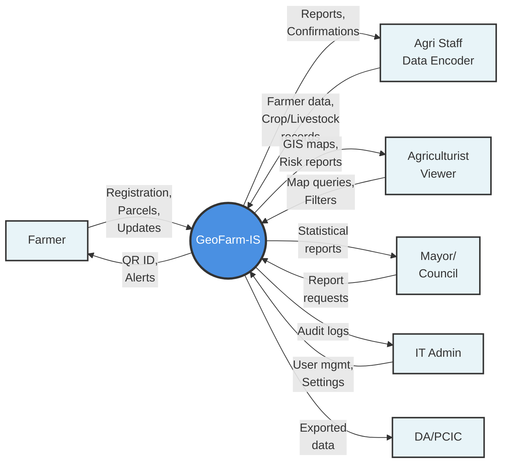
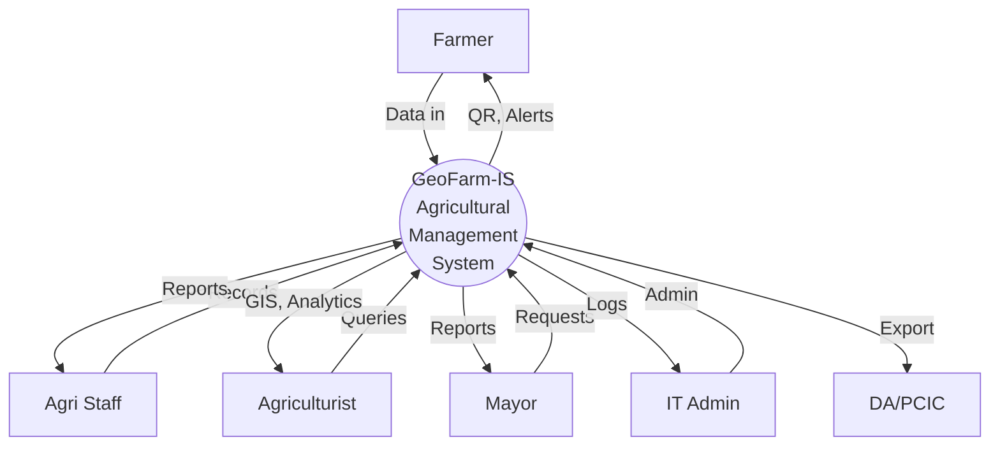

# Level 0 Context Diagram - A4 Size Prompt

## Prompt for Gemini (Compact A4 Layout):

```
Create a Level 0 Context Diagram for a thesis using standard DFD notation that fits on A4 paper in landscape orientation.

**System:** GeoFarm-IS - Agricultural Management System

**Layout Requirements:**
- Use LEFT-RIGHT layout (LR direction) to fit A4 landscape paper
- External entities as SQUARES on the left side
- Central system as CIRCLE in the middle
- Group similar flows to minimize arrows
- Keep labels SHORT and readable

**External Entities (6 actors):**

LEFT SIDE (Squares):
1. Farmer
2. Agri Staff
3. Agriculturist  
4. Mayor
5. IT Admin
6. DA/PCIC

CENTER:
- GeoFarm-IS (circle/rounded box)

**Data Flows (Simplified):**

FROM Farmer TO System:
- "Registration data, Parcel details, Updates, Requests"

FROM System TO Farmer:
- "QR ID, Status, Alerts"

FROM Agri Staff TO System:
- "Farmer data, Crop records, Livestock data"

FROM System TO Agri Staff:
- "Reports, Confirmations"

FROM Agriculturist TO System:
- "Map queries, Dashboard filters"

FROM System TO Agriculturist:
- "GIS maps, Risk reports"

FROM Mayor TO System:
- "Report requests"

FROM System TO Mayor:
- "Statistical reports (PDF/Excel)"

FROM IT Admin TO System:
- "User accounts, Settings"

FROM System TO IT Admin:
- "Audit logs, System status"

FROM System TO DA/PCIC:
- "Exported data (CSV/Excel)"

**Mermaid Format (Use this structure):**



**Output Requirements:**
1. Generate COMPLETE Mermaid code
2. Use LEFT-RIGHT (LR) layout
3. Keep labels SHORT (use <br/> for line breaks)
4. Group multiple data flows on single arrows
5. Make it fit A4 landscape paper when exported
6. Use professional colors (blue for system, light blue for entities)

Generate the complete, optimized Mermaid syntax now.
```

---

## Alternative Prompt (Vertical Compact Layout):

If horizontal doesn't work, try this vertical compact version:

```
Create a compact Level 0 Context Diagram that fits A4 portrait paper.

**Layout:** 
- TOP: 2 entities (Farmer, Agri Staff)
- LEFT: 2 entities (Agriculturist, Mayor)
- RIGHT: 2 entities (IT Admin, DA/PCIC)
- CENTER: GeoFarm-IS (large circle)

Use Mermaid subgraph or TD (top-down) direction with strategic positioning.



This creates a more balanced, compact layout suitable for A4 portrait orientation.
```

---

## Steps to Fit in A4:

1. **Use the LR (left-right) layout** for landscape
2. **Export as SVG** (scales better than PNG)
3. **In Mermaid Live Editor**:
   - Adjust zoom to fit screen
   - Export → SVG
   - Open SVG in Word/PowerPoint
   - Resize to fit A4 page
4. **Or use Draw.io**:
   - Import Mermaid code
   - Auto-arrange layout
   - Adjust spacing manually
   - Export as PNG/PDF at desired size

The key is using **shortened labels** and **grouped data flows** to reduce diagram width/height!
