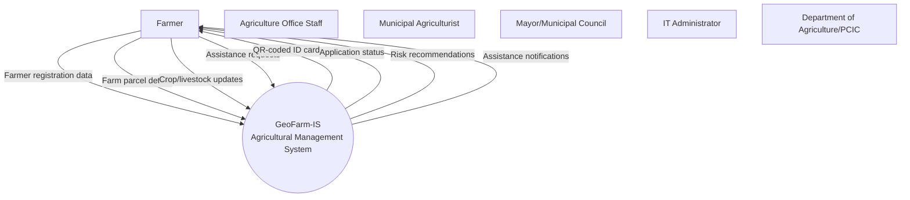

# Level 0 Context Diagram Prompt for Gemini

## Prompt to Send to Gemini:

```
Create a Level 0 Context Diagram (Data Flow Diagram) for my capstone project using Mermaid syntax.

**System Name:** GeoFarm-IS – Web-based Agricultural Management System with GIS and Predictive Farmer Analytics

**System Scope:** A comprehensive agricultural management system for the Municipal Agriculture Office of Tumauini, Isabela that manages farmer registration, GIS mapping, seasonal crop tracking, livestock inventory, assistance programs, and predictive analytics for identifying at-risk farmers.

**External Entities and Data Flows:**

1. **Farmer**
   - Inputs to system: 
     * Farmer registration data
     * Farm parcel details
     * Crop/livestock updates
     * Assistance requests
   - Outputs from system:
     * QR-coded ID card
     * Application status
     * Risk recommendations
     * Assistance notifications

2. **Agriculture Office Staff (Data Encoders)**
   - Inputs to system:
     * Farmer profiles
     * Seasonal crop records
     * Livestock inventory
     * Assistance distributions
   - Outputs from system:
     * Data entry confirmation
     * Generated reports
     * Printed QR IDs

3. **Municipal Agriculturist (Viewer role)**
   - Inputs to system:
     * Queries for GIS maps
     * Risk dashboard filters
   - Outputs from system:
     * Interactive GIS layers
     * Predictive risk summaries (palugi)
     * Downloadable reports

4. **Mayor / Municipal Council**
   - Inputs to system:
     * Requests for consolidated agricultural statistics
   - Outputs from system:
     * Aggregated reports (PDF/Excel) on crop production, livestock, assistance, and at-risk farmers

5. **IT Administrator (System Admin)**
   - Inputs to system:
     * User account creation
     * Role assignments
     * System settings
   - Outputs from system:
     * Account confirmation
     * Audit logs
     * System activity reports

6. **Department of Agriculture (DA) / PCIC**
   - Outputs from system:
     * Exported data files (CSV/Excel) for regional planning or insurance claims

**System Modules Included:** 
- Farmer Registry
- Seasonal Agricultural Tracking
- GIS Mapping
- Predictive Farmer Analytics
- Financial Assistance & Livestock Tracking

**Requirements:**
1. Output the diagram as **Mermaid syntax** (flowchart format)
2. Use proper DFD symbols:
   - Rectangles/boxes for external entities
   - A large circle or rounded rectangle for the central system (GeoFarm-IS)
   - Labeled arrows for data flows (clearly indicate direction)
3. The diagram must be:
   - Easy to read
   - Professional and suitable for a thesis
   - High resolution when exported
   - Clear labels for all data flows
4. Use this format:



Please generate complete Mermaid syntax for the entire Context Diagram with all entities and data flows listed above.
```

---

## How to Use the Mermaid Code:

1. **Copy the Mermaid code** from Gemini's response
2. **Go to Mermaid Live Editor**: https://mermaid.live/
3. **Paste the code** into the left panel
4. **The diagram will render** in the right panel
5. **Export as PNG/SVG**:
   - Click "Actions" → "PNG" or "SVG"
   - Save the high-resolution image
6. **Insert into your thesis**:
   - Word: Insert → Picture → From File
   - Google Docs: Insert → Image → Upload from computer
7. **Add caption**: "Figure X.X. Level 0 Context Diagram - GeoFarm-IS"

---

## Alternative: Use Draw.io

If you prefer Draw.io:
1. Copy the Mermaid code
2. Go to: https://app.diagrams.net/
3. File → Import from → Text → Mermaid
4. Paste the code and click Import
5. Edit and export as needed
